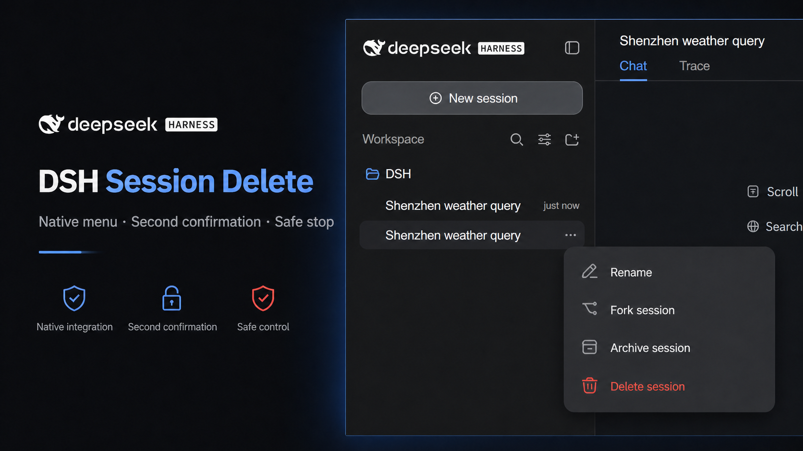
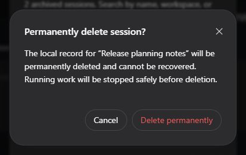

<div align="center">

# DSH Session Delete

**Bring permanent deletion to the native DeepSeek Harness session menu.**

Second confirmation · Running work is stopped safely · No full-page reload

[](https://github.com/WSL043/dsh-session-delete/releases/latest)
[](https://github.com/WSL043/dsh-session-delete/actions/workflows/ci.yml)
[](#compatibility)
[](LICENSE)

[中文](README.md) · [Install](#install) · [Use](#use) · [Safety boundary](#safety-boundary)

</div>

<p align="center">
  
</p>

| Native | Safe | Smooth |
| --- | --- | --- |
| Lives in the native session actions menu and keeps Archive available | Requires a second confirmation and safely stops running work | Refreshes session state in place without reloading the whole DSH page |

## Install

### Windows guided setup (recommended)

Open PowerShell and paste this one line:

```powershell
$u='https://github.com/WSL043/dsh-session-delete/releases/download/v0.1.6'; $p="$env:TEMP\dsh-session-delete-setup.ps1"; curl.exe -fL "$u/dsh-session-delete-setup.ps1" -o $p; curl.exe -fL "$u/dsh-session-delete-setup.ps1.sha256" -o "$p.sha256"; if ($LASTEXITCODE -ne 0) { throw 'Download failed' }; $want=((Get-Content "$p.sha256" -Raw) -split '\s+')[0]; if ((Get-FileHash $p -Algorithm SHA256).Hash -ne $want) { throw 'Checksum mismatch' }; powershell.exe -NoProfile -ExecutionPolicy Bypass -File $p
```

Setup asks for Chinese or English, then finds standard DSH and
[DSH-Portable](https://github.com/WSL043/DSH-Portable). If it finds more than one installation, it lists
their paths for selection; an existing release is updated automatically. It remembers both the selected
DSH and the previous workspace dependency so uninstall can restore the original value.

No administrator access or system Node.js/pnpm install is required. Setup never stops work or restarts
DSH; restart it manually when the operation finishes.

<details>
<summary><strong>Verify the setup helper before execution</strong></summary>

The entry command already verifies setup. Setup also verifies the manager and plugin package it downloads.

</details>

### Let an Agent install it

Give the Agent the
[version-pinned AGENTS.md](https://raw.githubusercontent.com/WSL043/dsh-session-delete/v0.1.6/AGENTS.md).
It defines installation, update, uninstall, rollback, and acceptance boundaries.

### macOS, Linux, or an existing `dsh` command

```sh
dsh plugin --profile web add "@deepseek-ai/dsh-client-ui-workspace@https://github.com/WSL043/dsh-session-delete/releases/download/v0.1.6/dsh-session-delete.tgz"
```

This universal command does not install the Windows manager. If the profile explicitly pinned an official
workspace package before installation, record and restore that value during uninstall. Restart DSH manually.

## Use

1. Open the actions menu beside the target session in the sidebar.
2. Choose the red **Delete session** action.
3. Check the session name, then select **Delete permanently**.

<p align="center">
  
  <br><sub>Permanent deletion still requires a second confirmation</sub>
</p>

Sessions opened through the standard Web UI after the plugin becomes active do not need to be closed
manually. If work is still running, the plugin stops it through DSH's lifecycle capability, waits for
quiescence, tears down the session, and then removes its local record.

## Safety boundary

> [!WARNING]
> Permanent deletion cannot be undone. Confirm the target session and make a backup when needed.

- Only the target session-owned directory in the default JSONL backend is deleted;
- Other plugins, external attachments, caches, indexes, logs, backups, and synchronized copies are outside
  its scope, so this is not a secure-erasure tool;
- Non-JSONL storage and custom hosts without a safe stop capability are refused instead of force-deleted;
- If the operating system refuses cleanup, the plugin reports that deletion could not be confirmed rather
  than misreporting partial completion as success.

This is an unofficial community plugin and is not affiliated with or endorsed by DeepSeek. You are
responsible for having authority to delete the target data and for meeting applicable retention
requirements. The software is provided under the [MIT License](LICENSE), without warranty.

## Compatibility

This release supports the default per-session JSONL storage in DeepSeek Harness `0.1.0-rc.6`,
`0.1.0-rc.7`, and `0.1.0-rc.8`. The package is built from the rc.8 client and retains tested fallbacks
for rc.6 and rc.7 hosts.

Dependency automation discovers future DSH versions, but they are not automatically claimed as compatible.
A support release is published only after installation, startup, the native menu, second confirmation, and
disposable-session deletion all pass.

## Update and uninstall

Windows guided-setup users only need:

| Action | Command |
| --- | --- |
| Update | `dsh-session-delete update` |
| Uninstall | `dsh-session-delete uninstall` |

Update downloads and verifies the latest immutable manager. Uninstall restores the workspace dependency
recorded before the first guided install. Neither action deletes sessions or restarts DSH.

For universal installations, update with the same `add` command from the new Release. Run the following
only when no explicit workspace dependency existed before installation:

For a standard `web` profile:

```sh
dsh plugin --profile web remove @deepseek-ai/dsh-client-ui-workspace
```

If the profile had an explicit workspace dependency, restore its recorded value with `add` instead of
removing the key. Restart DSH afterward.

<details>
<summary><strong>Messages you may see during installation</strong></summary>

- `dsh plugin ... list` is non-destructive to session data, but its first run may migrate a Portable
  profile, rebuild dependency links, or update a lockfile, so it is not strictly read-only on disk.
- This plugin contributes only a `dsh.client` injection. A missing `dsh.bundle` notice is expected and is
  not an installation failure.
- DSH supplies the runtime peers. They are marked optional here; assess warnings from other packages by
  package name.
- Every Release includes `.sha256` files for the setup helper, manager, and plugin package; the entry command verifies its SHA-256 before execution.

</details>

<details>
<summary><strong>Why does upstream provide Archive only?</strong></summary>

The official implementation note records a product decision: the former Delete entry was only a visual
placeholder and was replaced with non-destructive archive. The current JSONL persistence seam also has no
session-deletion contract. This is best understood as the current safety choice and interface boundary,
not as a claim that users should never be able to delete local data.

[Official archive decision](https://github.com/deepseek-ai/deepseek-harness/blob/master/.agents/notes/implemented/feature/2026-07-31-session-archive-global-set.md)
· [JSONL storage documentation](https://github.com/deepseek-ai/deepseek-harness/blob/master/packages/session/session-persistence-jsonl/README.md)

</details>

## Support and license

Open a [GitHub Issue](https://github.com/WSL043/dsh-session-delete/issues) for ordinary problems. Report
security issues privately as described in [SECURITY.md](SECURITY.md).

MIT. See [THIRD_PARTY_NOTICES.md](THIRD_PARTY_NOTICES.md) for the modified upstream client and its license
notice.
