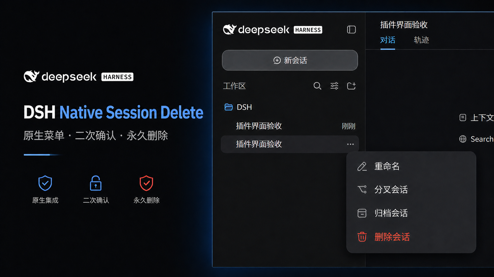

<div align="center">

# DSH Session Delete

**把“永久删除会话”带回 DeepSeek Harness 原生菜单。**

原生深色菜单 · 二次确认 · 运行中安全停止 · 原地更新列表

[](https://github.com/WSL043/dsh-session-delete/releases/latest)
[](https://github.com/WSL043/dsh-session-delete/actions/workflows/ci.yml)
[](#兼容性)
[](LICENSE)

[English](README.en.md) · [安装](#安装) · [使用](#使用) · [安全边界](#安全边界)

</div>

<p align="center">
  
</p>

| 原生 | 安全 | 顺滑 |
| --- | --- | --- |
| 删除入口就在会话原生操作菜单中，归档仍然保留 | 永久删除前必须二次确认（再次确认）；正在运行的任务会先安全停止 | 删除成功后原地刷新列表，不重载整个 DSH 页面 |

## 安装

### Windows 快速安装（推荐）

打开 PowerShell，复制这一行：

```powershell
irm 'https://github.com/WSL043/dsh-session-delete/releases/download/v1.0.3/install.ps1' | iex
```

助手依次检查当前目录、PATH、`DSH_PORTABLE_ROOT`、下载/桌面/文档目录，以及这些目录和
`LocalAppData\Temp` 下最多三层的 Portable 解压目录；找到后立即调用一次 DSH 官方 `plugin add`。
它不会递归扫盘、安装包管理器、保存 profile 快照、创建常驻命令或重复下载插件。普通 DSH 和
[DSH-Portable](https://github.com/WSL043/DSH-Portable) 都支持；如果发现多个 DSH，会停止并要求明确选择。

如果 DSH-Portable 不在常见位置，可明确指定，仍然不会扫描磁盘：

```powershell
& ([scriptblock]::Create((irm 'https://github.com/WSL043/dsh-session-delete/releases/download/v1.0.3/install.ps1'))) -DshPath 'D:\DSH-Portable\dsh.exe'
```

### 官方 CLI（macOS、Linux 或希望直接审阅命令）

```sh
dsh plugin --profile web add "dsh-native-session-delete@https://github.com/WSL043/dsh-session-delete/releases/download/v1.0.3/dsh-native-session-delete.tgz"
```

助手和这条命令使用的是同一个标准 bundle 安装机制；助手只是 Windows 入口，不接管安装事务。

安装完成后，保存工作并按 DSH 的正常方式重启一次，使新的 bundle 配置生效。

### 交给 Agent

请使用固定版本的 [AGENTS.md](https://raw.githubusercontent.com/WSL043/dsh-session-delete/v1.0.3/AGENTS.md)，
其中写明了安装、更新、验收、卸载和安全边界。不要把 `main` 分支文档当作安装依据。

## 使用

1. 打开侧边栏中目标会话右侧的原生操作菜单。
2. 选择红色的 **删除会话…**。
3. 核对会话名称，在确认弹窗中点击 **永久删除**；也可以随时点击 **取消**。

<p align="center">
  
  <br><sub>永久删除无法撤销，确认弹窗会明确显示目标会话</sub>
</p>

插件生效后，删除逻辑复用 DSH 的生命周期和会话存储能力。正在运行的任务会先安全停止并等待
收敛，然后删除目标会话；成功后只更新会话列表，不重载整个 DSH 页面。

## 安全边界

> [!WARNING]
> 永久删除无法撤销。点下确认前，请核对会话名称；需要保留的内容请先另行备份。

本插件的责任范围是：在 DSH 默认逐会话 JSONL 存储和宿主生命周期边界内，验证并移除用户明确
确认的目标会话独占目录。DSH 当前没有公开会话删除 API；二次确认是强制步骤，取消不会发送删除请求。

以下内容不在本插件的删除范围内，也不保证被清理：

- 其他会话、其他插件数据、外部附件、缓存、索引、日志、备份和云端/同步副本；
- 非 JSONL 存储或宿主没有安全停止能力的会话；这类情况会拒绝强删并报告未完成；
- 操作系统、文件系统、宿主更新或第三方同步服务造成的额外副本。

如果系统拒绝清理，插件会报告无法确认删除成功，不会把部分完成误报为成功。删除前请确认
自己有权处理目标数据，并遵守适用的数据留存、审计和隐私要求。本项目是非官方社区插件，
与 DeepSeek 无隶属或背书关系；按 [MIT 许可证](LICENSE)提供，不附带担保。

## 兼容性

<!-- dsh-compatibility -->
已自动验收：`0.1.0-rc.6`、`0.1.0-rc.7`、`0.1.0-rc.8`。新版本只有通过隔离安装、构建、测试和官方 Web UI 冒烟验收后才会加入此列表。
<!-- /dsh-compatibility -->

插件面向 DSH 默认逐会话 JSONL 存储，使用标准 `dsh.bundle` profile 层，将官方 workspace 行替换为唯一的
`dsh-native-session-delete` 原生客户端；卸载后 DSH 会恢复官方 workspace 行。

GitHub Actions 每 6 小时读取 DSH registry 的完整版本序列，并与官方不可变 Release 交叉验证。发现最早一个尚未覆盖的新版本后，会在隔离
profile 中重新安装官方 DSH 和待发布插件，验证构建、单元测试、原生菜单、红色删除项、二次确认、
取消不发请求及无整页刷新；全部通过才自动增加兼容范围并发布新的不可变补丁版本。任何检查失败都会
停止发布，现有兼容声明保持不变。上游发生结构性改动时仍需要代码修复，自动化不会猜测性修改删除逻辑。

## 更新与卸载

更新可重新运行快速安装助手，或使用新版本的同一条 `add` 命令。v1.0.3 的直接命令是：

```sh
dsh plugin --profile web add "dsh-native-session-delete@https://github.com/WSL043/dsh-session-delete/releases/download/v1.0.3/dsh-native-session-delete.tgz"
```

卸载只移除这个插件的 bundle 层，不删除任何会话：

```sh
dsh plugin --profile web remove dsh-native-session-delete
```

DSH-Portable 使用对应的 `.\dsh.exe plugin --profile web add ...` 或
`.\dsh.exe plugin --profile web remove dsh-native-session-delete`。完成安装、更新或卸载后，
按 DSH 的正常方式重启，使配置重新组合。

## 支持与许可证

普通问题请提交 [GitHub Issue](https://github.com/WSL043/dsh-session-delete/issues)；安全问题请按
[SECURITY.md](SECURITY.md) 私下报告。

MIT。修改后的上游客户端及其许可说明见 [THIRD_PARTY_NOTICES.md](THIRD_PARTY_NOTICES.md)。
